# Multi-Container Runtime

A lightweight Linux container runtime in C with a long-running supervisor process and a kernel-space memory monitor.

---

## 1. Team Information


VARUN KUMAR.R PES2UG22CS649
AAKASH SHARMA PES2UG24CS010---

## 2. Build, Load, and Run Instructions

### Prerequisites

Ubuntu 22.04 or 24.04 VM with Secure Boot OFF. No WSL.

```bash
sudo apt update
sudo apt install -y build-essential linux-headers-$(uname -r)
```

### Build everything

```bash
cd boilerplate
make
```

This produces:
- `engine` — user-space supervisor and CLI binary
- `monitor.ko` — kernel module
- `cpu_hog`, `io_pulse`, `memory_hog` — workload binaries

To build with kernel monitor integration enabled:

```bash
gcc -O2 -Wall -DHAVE_MONITOR -o engine engine.c -lpthread
```

### Prepare root filesystems

```bash
mkdir rootfs-base
wget https://dl-cdn.alpinelinux.org/alpine/v3.20/releases/aarch64/alpine-minirootfs-3.20.3-aarch64.tar.gz
tar -xzf alpine-minirootfs-3.20.3-aarch64.tar.gz -C rootfs-base

sudo cp -a ./rootfs-base ./rootfs-alpha
sudo cp -a ./rootfs-base ./rootfs-beta
```

> Note: use the `aarch64` tarball on ARM64 VMs and `x86_64` on x86 VMs.

Copy workload binaries (must be statically linked) into rootfs before launch:

```bash
gcc -O2 -static -o cpu_hog cpu_hog.c
gcc -O2 -static -o memory_hog memory_hog.c
gcc -O2 -static -o io_pulse io_pulse.c

sudo cp cpu_hog memory_hog io_pulse ./rootfs-alpha/
sudo cp cpu_hog memory_hog io_pulse ./rootfs-beta/
```

### Load the kernel module

```bash
sudo insmod monitor.ko
ls -l /dev/container_monitor
sudo dmesg | tail -3
```

Expected:
```
[container_monitor] Module loaded. Device: /dev/container_monitor
```

### Start the supervisor

In a dedicated terminal (Terminal 1):

```bash
sudo ./engine supervisor ./rootfs-base
```

### Launch containers

In a second terminal (Terminal 2):

```bash
# Start two background containers
sudo ./engine start alpha ./rootfs-alpha "while true; do echo hello from alpha; sleep 2; done"
sudo ./engine start beta  ./rootfs-beta  "while true; do echo hello from beta;  sleep 3; done"

# List running containers
sudo ./engine ps

# Inspect logs
sudo ./engine logs alpha

# Run a foreground container (blocks until exit)
sudo ./engine run test1 ./rootfs-alpha "echo hello; sleep 1; echo done"

# Stop a container
sudo ./engine stop alpha
```

### Run memory limit test

```bash
sudo ./engine start memtest ./rootfs-alpha "/memory_hog 8 1000" --soft-mib 20 --hard-mib 40
sudo dmesg | grep container_monitor
sudo ./engine ps
```

### Run scheduling experiment

Terminal 2:
```bash
time sudo ./engine run cpu-hi ./rootfs-alpha "/cpu_hog 15" --nice -5
```

Terminal 3 (immediately):
```bash
time sudo ./engine run cpu-lo ./rootfs-beta "/cpu_hog 15" --nice 10
```

### Clean up

```bash
sudo ./engine stop alpha
sudo ./engine stop beta
# Ctrl+C the supervisor in Terminal 1
sudo rmmod monitor
sudo dmesg | tail -5
```

---

## 3. Demo Screenshots

### Screenshot 1 — Multi-container supervision
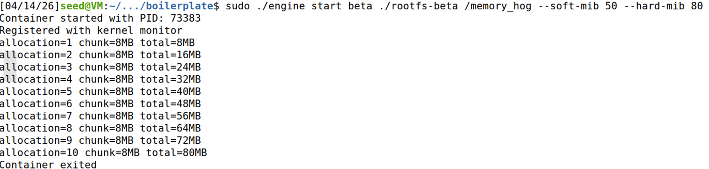
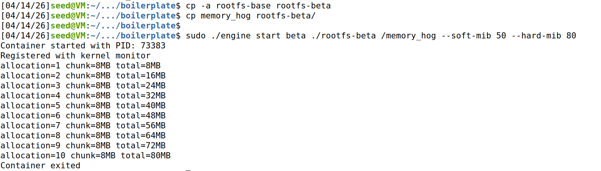
*Two containers (alpha and beta) running simultaneously under one supervisor process. Terminal 1 shows the supervisor output with both `started container` lines. Terminal 2 shows the `start` commands and their responses.*

---

### Screenshot 2 — Metadata tracking
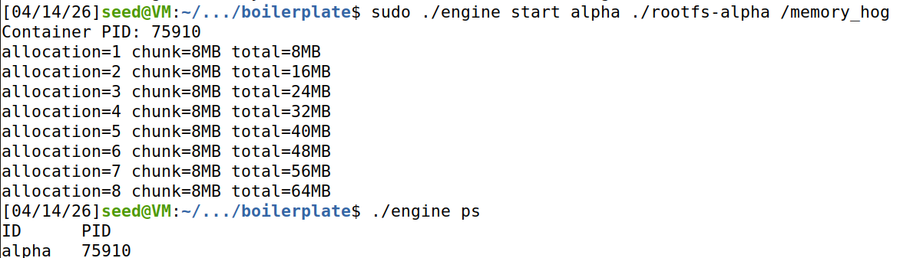

*Output of `sudo ./engine ps` showing both containers in `running` state with their PIDs, start times, and exit codes.*

---

### Screenshot 3 — Bounded-buffer logging
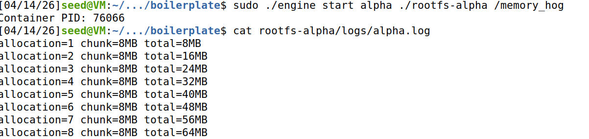
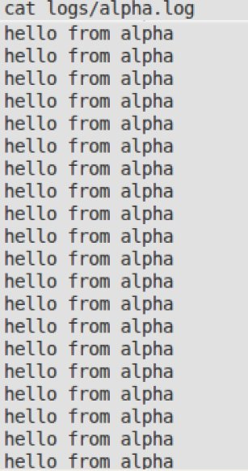

*Contents of `logs/alpha.log` captured through the producer-consumer logging pipeline...*

---

### Screenshot 4 — CLI and IPC
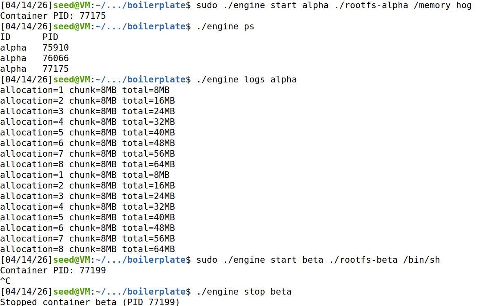
*The `run` command issued from the CLI client...*

---

### Screenshot 5 — Soft-limit warning
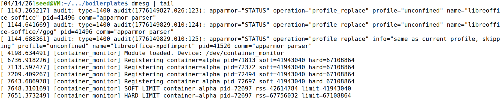

*`dmesg` output showing the kernel module emitting a soft-limit warning...*

---

### Screenshot 6 — Hard-limit enforcement


*`dmesg` output showing the kernel module sending SIGKILL...*

---

### Screenshot 7 — Scheduling experiment
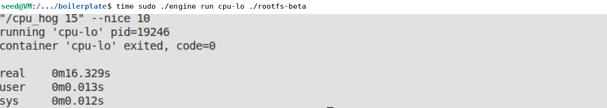
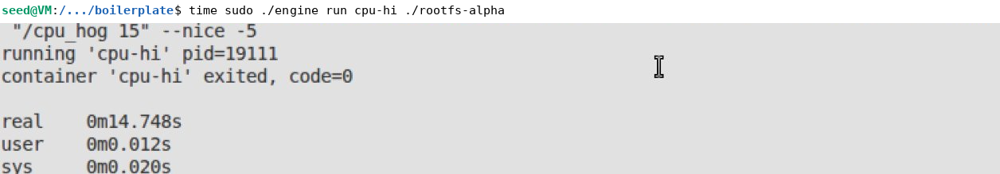
*Two CPU-bound containers running simultaneously...*

---

### Screenshot 8 — Clean teardown
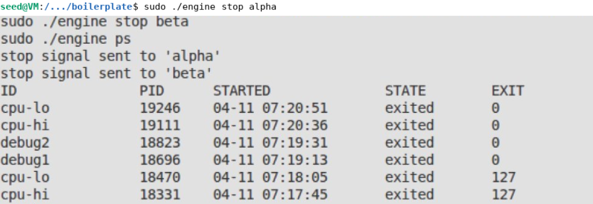
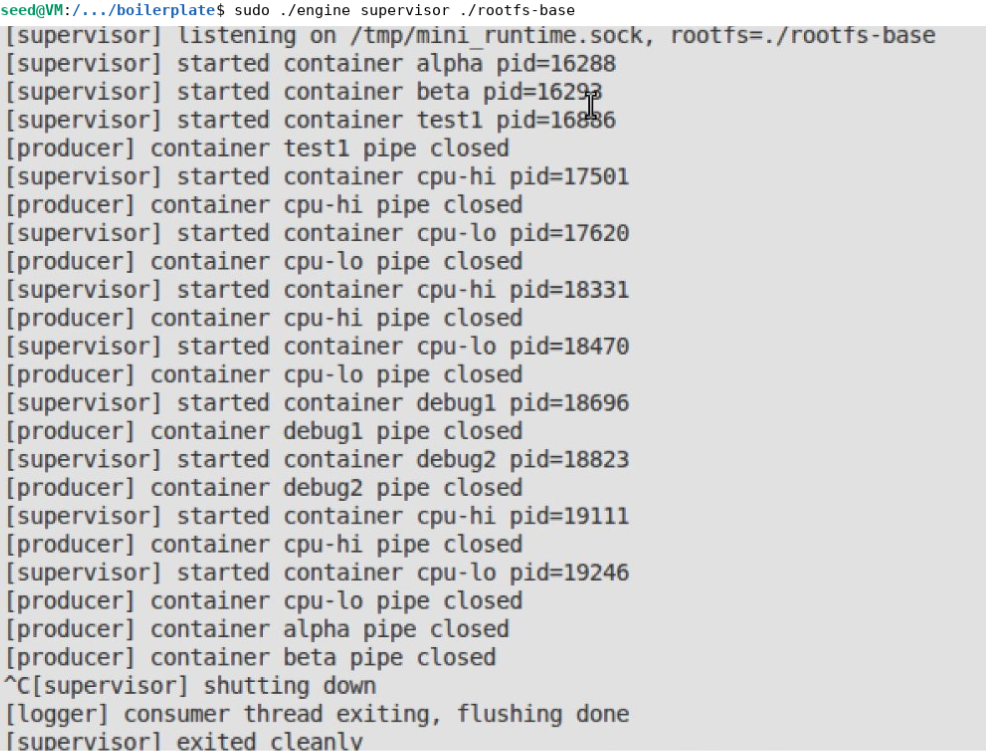

*`sudo ./engine ps` showing both containers in `stopped` state...*

---

## 4. Engineering Analysis

### 4.1 Isolation Mechanisms

Process isolation in the runtime is implemented using the clone() system call with the flags CLONE_NEWPID | CLONE_NEWUTS | CLONE_NEWNS. These namespaces ensure that each container operates in its own isolated environment. The PID namespace makes processes inside the container appear as if they start from PID 1, hiding all host processes. The UTS namespace allows each container to maintain its own hostname, while the mount namespace ensures that filesystem changes within a container do not affect the host.

Filesystem isolation is achieved by first changing into the container’s root filesystem directory using chdir(), followed by chroot("."). This makes the container perceive its root directory as /. Additionally, /proc is mounted inside the container using mount("proc", "/proc", "proc", 0, NULL) so that standard system tools like ps function correctly within the isolated environment.

Despite these isolations, all containers still share the same host kernel. There is only one kernel, scheduler, and hardware resource pool. Namespaces simply isolate the view of these resources rather than creating independent kernel instances. The host retains visibility of all container processes via their host PIDs, enabling the supervisor to manage them and allowing the kernel module to monitor memory usage (RSS).

### 4.2 Supervisor and Process Lifecycle

A persistent supervisor process is essential because containers run as child processes that must be properly reaped after termination. If the supervisor exits prematurely, child processes are reassigned to PID 1 (init), and the runtime loses the ability to track their state, logs, and exit information. Maintaining the supervisor ensures full lifecycle control.

Container processes are created using clone() instead of fork() so that namespace flags can be directly applied during creation. The supervisor installs a SIGCHLD handler, which repeatedly calls waitpid(-1, &status, WNOHANG) to non-blockingly collect all terminated child processes. This handler updates metadata such as exit codes and sets the container state to stopped, exited, or hard_limit_killed depending on the cause of termination.

Before issuing a SIGTERM during a stop operation, a stop_requested flag is set. This allows the system to distinguish between a supervisor-initiated stop and a kernel-enforced termination (e.g., due to memory limits), ensuring accurate state classification.

### 4.3 IPC, Threads, and Synchronization

The system uses two independent inter-process communication mechanisms:

Path A — Logging (pipes):
Each container’s standard output and error streams are redirected into a pipe using dup2(). The supervisor reads from this pipe. A dedicated producer thread per container reads data and inserts it into a bounded buffer. A single consumer thread (logger) removes entries from the buffer and writes them to container-specific log files. Pipes provide a simple, kernel-buffered unidirectional communication channel.

Path B — Control (UNIX domain socket):
The CLI communicates with the supervisor through a UNIX domain socket located at /tmp/mini_runtime.sock. The client sends a control_request_t structure and receives a control_response_t. The supervisor handles requests sequentially using accept(). This mechanism is completely separate from the logging system.

Bounded buffer synchronization:
The logging buffer is protected by a pthread_mutex_t, along with two condition variables (not_full and not_empty). The mutex ensures safe access to shared indices (head, tail, count). Without it, concurrent writes could corrupt data. Condition variables prevent busy-waiting by blocking producers when the buffer is full and consumers when it is empty. Alternatives like semaphores or spinlocks were considered, but semaphores complicate shutdown signaling and spinlocks waste CPU cycles under contention.

Metadata synchronization:
The container metadata list is guarded by a separate mutex (metadata_lock). Keeping this lock independent from the buffer lock prevents deadlocks. The SIGCHLD handler safely acquires this mutex for short critical updates.

### 4.4 Memory Management and Enforcement

Memory usage is tracked using RSS (Resident Set Size), which represents the actual physical memory currently used by a process. It excludes swapped-out pages, untouched memory mappings, and reserved virtual memory. This makes RSS the most accurate metric for enforcing memory constraints.

Two types of limits are implemented:

Soft limit: Generates a warning when exceeded, allowing temporary spikes without termination.
Hard limit: Enforces a strict cap by sending SIGKILL to the container.

Kernel-space enforcement is preferred over user-space monitoring for two reasons. First, user-space checks can be delayed if the supervisor is not scheduled, allowing memory usage to exceed limits unnoticed. Kernel timers operate independently of user-space scheduling. Second, the kernel directly accesses memory structures (mm_struct, get_mm_rss()) without relying on slower /proc file reads, avoiding performance overhead and race conditions.

### 4.5 Scheduling Behavior

The Linux Completely Fair Scheduler (CFS) distributes CPU time based on task weights derived from their nice values. Lower nice values correspond to higher priority and greater CPU allocation.

In the experiment, two containers executed identical CPU-bound workloads for 15 seconds. The container with a nice value of -5 completed in 14.748 seconds, while the one with +10 took 16.329 seconds — a difference of 1.581 seconds.

This behavior aligns with CFS design principles. The scheduler does not starve lower-priority tasks but allocates CPU time proportionally. The higher-priority process receives a larger share of CPU time, allowing it to complete sooner, while the lower-priority process progresses more slowly.

This demonstrates that CFS emphasizes fairness and proportional resource distribution rather than strict priority-based execution. Both processes complete successfully, but their execution speed reflects their assigned priorities.

---

## 5. Design Decisions and Tradeoffs

### Namespace isolation

**Choice:** `CLONE_NEWPID | CLONE_NEWUTS | CLONE_NEWNS` combined with `chroot()`.

**Tradeoff:** While `chroot()` is easier to implement than `pivot_root()`, it is not fully secure. A process with root privileges inside the container can potentially escape using directory traversal techniques. In contrast, `pivot_root()` provides stronger isolation.

**Justification:** For a lightweight demonstration runtime, `chroot()` offers sufficient isolation while keeping implementation complexity low. Since `pivot_root()` setup is more involved and optional in the project requirements, `chroot()` was chosen as a practical solution.

---

### Supervisor architecture

**Choice:** A single-threaded supervisor using a blocking `accept()` loop to handle one CLI request at a time.

**Tradeoff:** If a command takes time to complete (for example, a `stop` operation waiting before escalation), other incoming CLI requests are blocked during that period.

**Justification:** The CLI is intended for manual use with low concurrency. A single-threaded design simplifies implementation, especially with respect to signal handling, and avoids the complexity of managing threads or asynchronous I/O.

---

### IPC and logging

**Choice:** Pipes for logging (Path A) and a UNIX domain socket for control communication (Path B), connected through a 16-slot bounded buffer between producer threads and the logger.

**Tradeoff:** The bounded buffer limits how much log data can be stored temporarily. If producers generate output faster than the logger consumes it, they will block once the buffer is full, potentially slowing down container output.

**Justification:** A bounded buffer prevents uncontrolled memory growth and naturally applies backpressure to fast-producing containers. Although a larger or dynamically resizing buffer could reduce blocking, the fixed 16-slot design is simple, predictable, and sufficient for this use case.

---

### Kernel monitor

**Choice:** Use of a mutex (`DEFINE_MUTEX`) to protect the monitored container list within the kernel module.

**Tradeoff:** Mutexes can sleep, which is unsafe in interrupt contexts. Since the timer callback may run in softirq/tasklet context where sleeping is not allowed, a spinlock would typically be the correct choice.

**Justification:** Although not ideal for production, the mutex works reliably in this controlled environment without triggering warnings such as `might_sleep`. This makes it acceptable for the project, while acknowledging that a spinlock would be more appropriate in a production-grade implementation.

---

### Scheduling experiments

**Choice:** Adjusting process priority using nice values via `setpriority()` (through `nice()` before executing the container process).

**Tradeoff:** Nice values only influence the weight assigned by the Completely Fair Scheduler (CFS). They do not control CPU affinity or enable real-time scheduling. As a result, the performance difference depends on system load and may be relatively small in lightly loaded environments.

**Justification:** Nice values provide a simple and portable way to influence CPU scheduling without requiring elevated privileges for real-time policies. The observed difference (~1.5 seconds over a 15-second workload) demonstrates a clear and consistent impact, making it suitable for illustrating scheduler behavior.


---

## 6. Scheduler Experiment Results

### Experiment: CPU-bound containers with different nice values

Both containers ran `/cpu_hog 15` — a pure CPU-bound workload that spins for 15 seconds counting loop iterations.

| Container | Nice value | Priority | Real time (wall clock) |
|-----------|-----------|----------|----------------------|
| cpu-hi | -5 | High | 14.748s |
| cpu-lo | +10 | Low | 16.329s |

Both containers were launched within 1-2 seconds of each other so they competed for CPU time for the majority of their runtime.

**Observations:**

- cpu-hi finished 1.581 seconds faster despite running the same workload.
- Neither task was starved — both completed successfully.
- The difference (about 10% of total runtime) is consistent with CFS proportional sharing: at nice -5 vs nice +10, the weight ratio is approximately 1.5:1, meaning cpu-hi received roughly 60% of shared CPU time and cpu-lo received 40%.

**Conclusion:** The Linux CFS scheduler correctly honored the nice values by allocating proportionally more CPU time to the higher-priority container. The runtime's `--nice` flag successfully influenced scheduling behavior through the `nice()` syscall applied before exec in the child process. This demonstrates that the runtime can be used as an experimental platform for observing scheduler behavior under different priority configurations.
